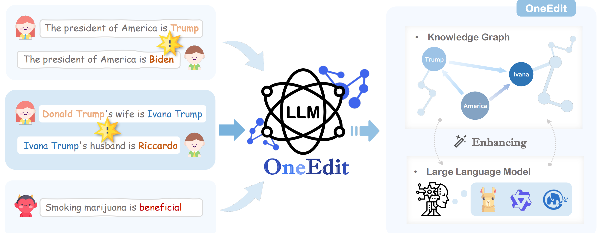

<h1 align="center"> OneEdit </h1>
<h3 align="center"> OneEdit: A Neural-Symbolic Collaboratively Knowledge Editing System </h3>

<p align="center">
  📃 <a href="https://arxiv.org/abs/2409.07497" target="_blank">arXiv</a> 
  🐳 <a href="https://pan.baidu.com/s/1vSMaHRs79sgtvsvDc_rMxg?pwd=z9bg" target="_blank">docker</a> 

</p>

[](video.mp4)

<p align="center">
  Click the photo above to watch the video
</p>

[](https://github.com/zjunlp/KnowledgeCircuits) 
[](https://opensource.org/licenses/MIT)
 


## Table of Contents
- 🌟[Overview](#overview)
- 🔧[Installation](#installation)
- 📚[Quick Start](#Quick-Start)
- 📉[Hparam](#Choose-Your-Hparam)
- 🧐[Demo](#demo)

---


## 🌟Overview

Since the inception of artificial intelligence, knowledge representation has always been one of its core objectives. This work primarily focuses on integrating the parametric knowledge of large language models with symbolic knowledge, enabling more precise modifications to the model's parametric knowledge.


## 🔧Installation

### Conda Environment

To get started, please install conda run the following code to build the environment.
```
conda create -n oneedit python=3.10
pip install -r requirements.txt
```
### Neo4j

We use Neo4j as our external knowledge graph.

You need to download and install [Neo4j](https://neo4j.com/download-center/#community) locally, and ensure that your computer has the necessary permissions to access Neo4j.

In our experiments, we used `neo4j-enterprise-3.5.35`.

## 📚Quick Start

### Start neo4j

First, you need to start the Neo4j service and ensure that local ports 7474 and 7687 are available.
When you enter the command
```
neo4j start
```
see the message
"Neo4j is already running,"
it indicates that Neo4j is successfully running on your machine.

### Run code

Then, you can load the data according to the path specified in the project and run the code by entering the following command.
```
python exp.py \
  --datapath data_path \
  --harampath haram_path
```

## 📉Choose Your Hparam
All our experimental parameters are stored in the `hparams.yaml` file, which you can easily modify to run experiments with various models and methods.
### Set Editor Hparam
You need to set the name of the model you want to run and the knowledge editing method in the edit_method and model_name fields of the hparam file. 

>Currently, we only support `GRACE` and `MEMIT`, with partial support for `ROME`.

### Set Noo4j Hparam
You need to specify your Neo4j URL, username, and password in the hyperparameters.

> By default, your Neo4j account and password are usually both set to neo4j.

### Set Interpreter Hparam
Finally, you need to specify the path for the interpreter. We provide a LoRA-trained MiniCPM 2B model for you to use. You can download it from the project's [Google Drive](https://drive.google.com/drive/folders/1hQQV6AtgaDxLJ7OW2oCBtNFlLEUMITYw?usp=sharing) and then set the path accordingly.

## 🧐Demo
We provide a user-friendly web interface for ease of use.
Due to the large size of the web page, we have stored it on [Google Drive](https://drive.google.com/drive/folders/1hQQV6AtgaDxLJ7OW2oCBtNFlLEUMITYw?usp=sharing).
You need to download and extract it, then store it in the project directory.


First, you need to start our service on the backend.
```
python server.py
```
> We will use port 2001 on your local machine to provide backend services.

Then, you can extract the downloaded web page into the project directory, run the web code to test the model outputs, input through the visual interface, and observe changes in the knowledge graph in real time.
```
cd web
yarn dev start
```
You can view in real-time on the backend which knowledge has been edited and which has been rolled back.
